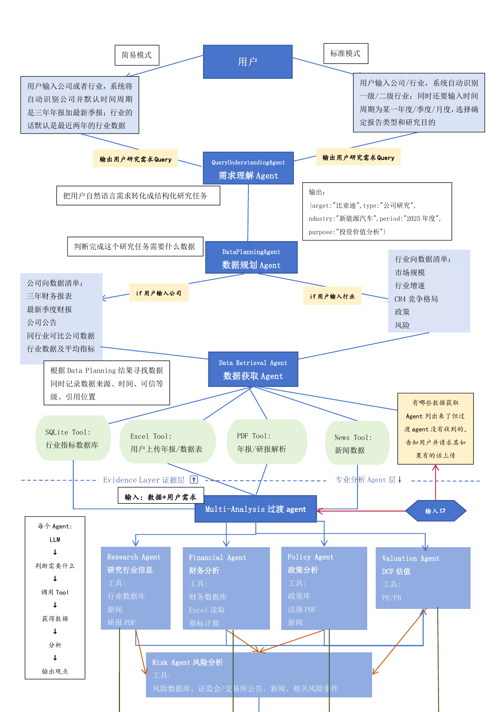
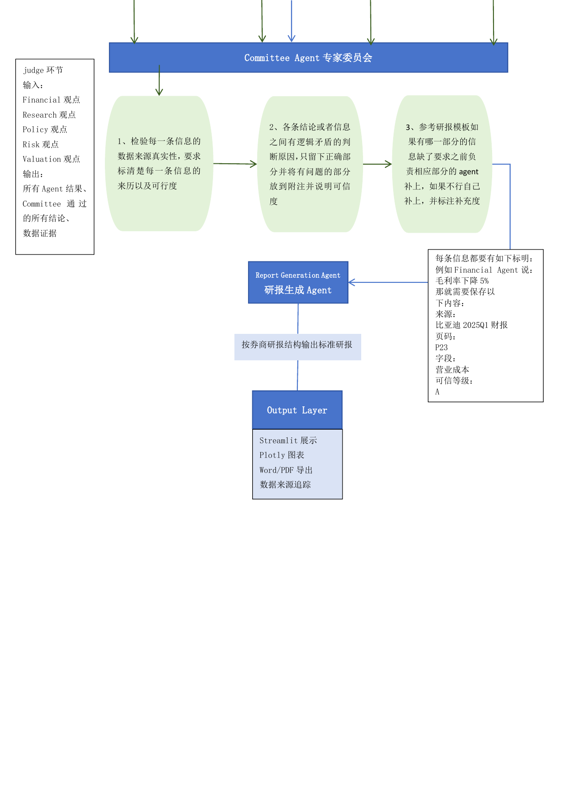

# Strategic AI System — AI 多智能体智能投研系统

[](https://jbmelfwhrlgagcsrpvhkqy.streamlit.app)

一个以 **多智能体协作** 为核心、**数据可溯源** 的智能投研系统：把一次完整的投研工作（行业研究、财务审计、估值建模、多空辩论、风险复核、报告撰写）拆解为 7 个智能体接力执行的流水线，并给每条核心结论挂上可追溯的证据链。

---

## 项目简介

投研工作最大的痛点不是信息不足，而是 **信息过载 + 结论不可信**：单一大模型直接生成研报容易幻觉、数字没有来源、多空逻辑纠缠不清。

本项目把一次研究任务拆成一条工业化的流水线：

1. **需求理解** —— 把用户一句话转化为结构化研究任务；
2. **数据规划与获取** —— 明确要哪些数据，从本地数据库、知识库、文件与新闻中取数并记录来源；
3. **专业分析** —— 行业研究 / 财务分析 / 政策分析 / 估值 / 风险 五个 Agent 各司其职；
4. **多空辩论** —— 财务专家与风险总监正面对抗，降低确认偏误；
5. **专家委员会终审** —— 消除矛盾、交叉验证，产出带可信度等级的证据链；
6. **研报生成** —— 按券商研报结构输出完整报告与可视化看板。

## 核心特性

- **7-Agent 协作流水线**：需求理解 → 数据规划 → 数据获取 → 专业分析（行业/财务/政策/估值/风险）→ 多空辩论 → 专家委员会 → 研报生成，全程可视化跟踪每个 Agent 的状态。
- **函数调用（Function Calling）**：DCF 两阶段估值、杜邦分解、财务数据库查询等工具由模型自主触发，不是"嘴上分析"，而是真实计算。
- **RAG 本地知识库**：自动索引知识库中的 PDF 文档（货币政策报告等），检索宏观政策底稿，让分析有据可依。
- **多空辩论机制**：Financial Agent（乐观方）与 Risk Agent（风险审计方）围绕同一标的对抗质证，把多空证据完整摊开。
- **数据证据链（Evidence Ledger）**：专家委员会对每条核心结论标注 来源 / 字段 / 页码 / 可信等级（A/B/C），输出可复核、可审计的存证面板。
- **可视化看板**：杜邦对标柱状图、能力雷达图、市场规模与增速、风险雷达、3D 产业链图谱等，均可导出 PDF。
- **真实数据底座（2026 升级）**：通过 akshare 东方财富业绩报表同步全市场（5000+ 家、100+ 行业）真实财务数据，按报告期聚合 CR4 / ROE / 净利率 / 毛利率；行业基准表带「报告期 / 样本数 / 数据来源」标注，页面实时展示数据截至日期，支持一键刷新。
- **3D 产业链全景图（真实环节库）**：覆盖新能源汽车、白酒、家电、房地产、银行、医药、半导体、光伏、机器人等行业；鼠标悬停每个环节即显示：主要业务内容、龙头/主要企业、该环节成本特征、利润率区间、环节特点与数据来源。
- **风险雷达真实化**：五个风险维度全部改为真实财务指标映射（权益乘数 / 现金流质量 / 毛利率缺口 / ROE 差距 / 政策基准），hover 展示每条维度的计算口径。
- **资料缺口审查（研报生成前）**：启动研究前先自动体检——列出本次研究缺哪些数据、为什么找不到（数据源限制/无订阅/无公开接口），并给出上传窗口；上传年报 PDF / 财务数据表 / 政策文本自动解析入库并参与研究，缺料报告会在报告中如实标注「信息缺口说明」。
- **报告导出**：一键导出 Word 深度研报（封面 + 全部图表 + 证据链 + 正文 + 缺口说明 + 免责声明，JPMC/Deloitte 深蓝·绿配色）与 **PPT 演示版研报**（16:9，JPMC 风格：左图右文·图文并茂、表格自动收缩不出边界、每页底部数据来源标注）。
- **实时新闻与公告（2026 升级）**：内置新闻/公告抓取器——东方财富公告大全（个股+全市场）、7×24 实时快讯、搜狗新闻搜索、财新网、新闻联播文字稿，均无需额外付费 API；新闻/公告自动注入各 Agent（政策/风险/研报）并带来源链接，资料缺口审查同步更新。
- **龙头公司横向对比（2026 升级）**：按行业自动选取 3~4 家龙头，通过东方财富财务摘要接口抓取真实 ROE/毛利率/净利率/EPS 等指标做横向对比（带兜底基准），生成对比表格 + 分组柱状图，并写入研报正文与 PPT。
- **网页图表读取（2026 升级）**：系统可读取网页正文、HTML 表格与内嵌图表数据（ECharts / Chart.js / Highcharts / 全局 JSON 数据块），作为 Agent 工具（search_latest_news / read_webpage_charts）供自动调用。
- **3D 产业链全景逻辑流（每次必现）**：覆盖新能源汽车、白酒、家电、房地产、银行、医药、半导体、光伏、机器人等行业；未收录行业自动生成「通用产业链框架」保证每次呈现，并结合实时新闻检索充实各环节动态。
- **学习资料库（内部知识库）**：内置 Forage 模拟（BCG / 摩根大通 / 花旗 / KPMG / PwC / Deloitte）与券商行研方法论学习笔记，仅供 AI 投研 Agent 内部检索调用（不对访客开放浏览/下载），支持管理员上传资料入库。
- **资料缺口审查（研报生成前）**：启动研究前先自动体检——列出本次研究缺哪些数据、为什么找不到（数据源限制/无订阅/无公开接口），并给出上传窗口；上传年报 PDF / 财务数据表 / 政策文本自动解析入库并参与研究，缺料报告会在报告中如实标注「信息缺口说明」。
- **双模式输入**：简易模式（一句话快速分析）与标准模式（公司/行业 + 时间周期 + 报告类型 + 研究目的自定义）。
- **产品化功能**：首屏示例问题一键填充、年报 / 财务数据表上传解析（PDF / XLSX / CSV）、报告收藏与可分享链接（`?report=<id>` 直达报告）、使用数据看板（累计研究次数 / 平均耗时 / Token 用量与成本 / 各 Agent 耗时分布）。

## 系统架构





架构分为五层：

| 层级 | 职责 |
| --- | --- |
| 输入层 | 用户输入公司/行业、时间周期、研究目的 |
| Agent 层 | 7 个 Agent：需求理解、数据规划、数据获取、行业研究、财务分析、政策分析、估值、风险、专家委员会、研报生成 |
| 工具层 | DCF、杜邦分析、SQLite 查询、Excel/PDF/新闻读取、网页图表读取、龙头对比等可执行工具 |
| 数据层 | SQLite 基准库（行业/个股/政策/风险）+ RAG 向量知识库 + 申万行业分类 |
| 输出层 | Streamlit 可视化看板、Word/PDF 报告、数据证据链 |

## 在线演示

👉 [https://jbmelfwhrlgagcsrpvhkqy.streamlit.app](https://jbmelfwhrlgagcsrpvhkqy.streamlit.app)

> 免费托管的应用在闲置一段时间后会进入休眠，首次打开可能需要等待约半分钟，属正常现象。

## 快速开始

```bash
# 1. 克隆仓库
git clone https://github.com/zhua-42/Strategic_AI_System.git
cd Strategic_AI_System

# 2. 安装依赖（Python >= 3.10）
pip install -r requirements.txt

# 3. 配置密钥
cp .env.example .env   # Windows: copy .env.example .env
# 编辑 .env，填入你的 DEEPSEEK_API_KEY

# 4. 启动
streamlit run app.py
```

云端部署（Streamlit Community Cloud）时，请在应用的 **Secrets** 中配置同样的 `DEEPSEEK_API_KEY`。

## 项目结构

```text
app.py                  # Streamlit 主应用：7-Agent 流水线 + 全部 UI
data_updater.py         # 真实数据同步器（akshare 全市场业绩报表 → SQLite 行业/个股基准）
industry_chain_data.py  # 产业链知识库（9+ 行业 × 5 环节：业务/龙头/成本/利润率/特点 + 通用框架）
report_export.py        # 文档导出引擎（matplotlib 图表渲染 + Word + JPMC 风格 PPT）
learning_data.py        # 学习资料库（内部知识库：Forage / 行研方法论入库与检索）
news_fetcher.py         # 实时新闻/公告抓取器（东方财富公告/快讯/搜狗/财新/央视，无需付费 API）
web_reader.py           # 网页读取器（正文 + HTML 表格 + 内嵌图表数据 ECharts/Chart.js/Highcharts）
leader_compare.py       # 龙头公司横向对比（3~4 家龙头真实财务摘要 + 兜底基准）
company_data.csv        # 个股财务基准数据
industry_data.csv       # 行业财务基准数据
financial_research.db   # SQLite 数据库（行业/个股/政策/风险基准表 + 学习资料表）
assets/fonts/           # 开源中文字体（思源黑体，用于导出图表）
knowledge/
  ├── learning/         # 学习资料（md/pdf，入库 learning_resources 表）
  ├── gap_uploads/      # 缺口审查上传的资料自动归类
  └── industry/         # 申万行业分类与个股映射
docs/                   # 系统架构图
```

## 技术栈

| 类别 | 技术 |
| --- | --- |
| 应用框架 | Python · Streamlit |
| 大模型 | DeepSeek（OpenAI SDK · Function Calling） |
| 数据 | SQLite · pandas · akshare（业绩报表/公告/财务摘要） |
| RAG | ChromaDB · sentence-transformers · pdfplumber |
| 可视化 | Plotly（页面） · matplotlib（导出） |
| 实时信息 | 东方财富公告/快讯 · 搜狗新闻 · 财新 · 新闻联播（requests + BeautifulSoup） |
| 文档导出 | python-docx · python-pptx · kaleido |

## Roadmap

- [x] 示例问题一键填充
- [x] 上传年报 / 财务数据表（PDF / XLSX / CSV）并接入分析流水线
- [x] 报告收藏与分享链接
- [x] 使用数据看板（研究次数 / 耗时 / Token 成本 / Agent 耗时分布）
- [ ] 量化评测集：构建回归测试集，与裸 LLM 基线对比（引用覆盖率 / 事实准确率 / 报告结构完整度）
- [ ] ESG 报告抓取与评级智能体
- [ ] 并购标的尽职调查智能体
- [ ] 定时盯盘与推送（盘前分析 / 盘中提示 / 周报）

## 免责声明

本系统所有输出均由 AI 生成，仅供学习与研究参考，**不构成任何投资建议**。系统中的数据来源以标注为准，投资决策与风险由使用者自行承担。
